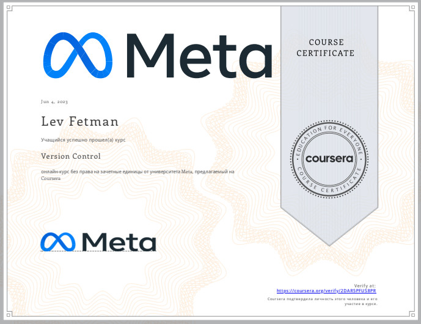

# Lev Fetman #
## Junior Front-end developer ##

### Contact information ###
**Email:** lfetman@gmail.com  

**Linkedin:** [Lev Fetman](https://www.linkedin.com/in/lev-fetman-702975223/)

### Work experience ###

- **Monitoring engineer** (01.05.2021 — 13.10.2022)
    - Company: MMDSmart (Ukraine, Kyiv)

- **Junior filmmaker** (01.06.2019 — 31.07.2019)
    - Company: Epicenter (Ukraine, Kyiv)

### Education ###

- Third year student (bachelor program) of **National university of life and environmental science of Ukraine** (**Specialty:** Computer engineering);
- 2020-2021 Cisco Academy;
- 2018-2019 English courses DEC School;
- 2017-2018 German courses Goethe Institut;
- 2016-2018 computer academy “Step”;
- July 2022-September 2022 – internship at **National Taiwan university of science and technologies** ( 5G networks)
-  October 2022-to the present day – exchange student at **Bern university** (Computer science)

### Skills: ###

- **Languages:**
    - German - B2
    - English - B2
    - Ukrainian - mother language

- **IT knowledges:**

    - SQL – junior;
    - Js – junior;
    - Zabbix – junior;
    - HTML/CSS – middle;
    - React - junior
    - POSTMAN – junior;
    - Webdriver.io framework – junior ;
    - Cucumber – junior

### Meta Certificates ###
()

### Extracurricular activities: ###
I am a quick learner, well-organized and communicable. Able to prioritize and adapt well to new situations. Besides that I am a team worker.